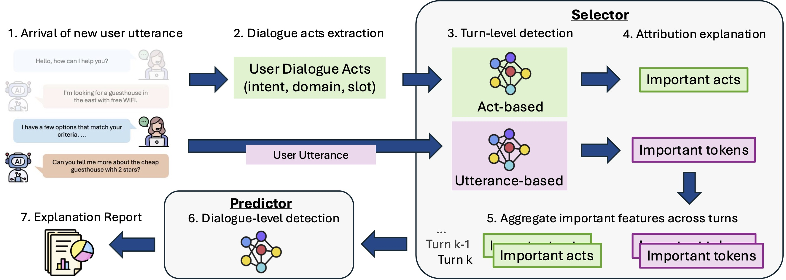

# 🤔EMMM, Explain Me My Model!
[**Paper**]() | [**Datasets**](#datasets) | [**EMMM Framework**](#emmm-framework)

## Introduction
**EMMM** is an explainable LLM chatbot detection framework, targetting MGT detection and its interpretability to diverse stakeholders in online conversational settings. This repository contains:
- Implementation of our proposed EMMM framework.
- Scripts to train, use, and evaluate a model of the EMMM framework.
- Customer service line synthetic user dialogues.

## Datasets
Datasets are preprocessed, containing the dialogues and extracted dialogue acts. 

### Frames (Synthetic)
- Frames (Synthetic) dataset construction prompts and pipeline can be found in [E2E_generation_Frame.py](LLM/E2E_generation_Frame.py).
- Datasets can be accessed from [Hugging Face](https://huggingface.co/datasets/AngieYYF/Frames-synthetic-customer-service-dialogue).
- Datasets include:
    - Bona Fide (original Frames dataset): [Frames paper](https://aclanthology.org/W17-5526/), [file](dataset/Frames/frames_bona_fide.pkl)
    - End-to-End Conversation (synthetic dataset generated): [file](dataset/Frames/frames_e2e.pkl)
- train/val/test splits of dialogues are based on dia_no, recorded [here](dataset/Frames/dataset_splits.pkl).
- The datasets are of pkl file format and contain the following columns:

| Dataset                    | Column            | Description                                                                                              |
|----------------------------|-------------------|----------------------------------------------------------------------------------------------------------|
| **All**                     | *dia_no* | Unique ID for each dialogue. Dialogues with the same ID across datasets are based on the bona fide dialogue with the same *dia_no*. |
|                            | *unmasked_dia*             | The dialogue itself, either bona fide or synthetic.                                                      |
|                            | *dia*             | The dialogue itself, either bona fide or synthetic, with sensitive information masked.                                                      |
|                            | *dialogue_act*             | The dialogue acts of each utterance within the dialogue.                                                     |
|                            | *dialogue_act_info_removed*             | The dialogue acts of each utterance within the dialogue, with sensitive information masked.                                                     |
| **Bona Fide**               | *goal_outcome*        | The  user goals and outcomes with format: "goal_1 \<sep\> goal_2 \<sep\> ... \<sep\> goal_n \<outcome\> outcome_1 \<sep\> outcome_2 \<sep\> ... \<sep\> outcome_n"     |

### SPADE
- The **SPADE** dataset can be downloaded from [Hugging Face](https://huggingface.co/datasets/AngieYYF/SPADE-customer-service-dialogue), with dataset construction frameworks described in their [paper](https://aclanthology.org/2025.llmsec-1.11/).
- train/val/test splits of dialogues are based on dia_no, recorded [here](dataset/SPADE/dataset_splits.pkl).
- The datasets (stored [here](dataset/SPADE)) are of pkl file format and contain the following columns:

| Dataset                    | Column            | Description                                                                                              |
|----------------------------|-------------------|----------------------------------------------------------------------------------------------------------|
| **All**                     | *dia_no* | Unique ID for each dialogue. Dialogues with the same ID across datasets are based on the bona fide dialogue with the same *dia_no*. |
|                            | *dia*             | The dialogue itself, either bona fide or synthetic, with sensitive information masked.                                                      |
|                            | *dialogue_act*             | The dialogue acts of each utterance within the dialogue.                                                     |
|                            | *dialogue_act_info_removed*             | The dialogue acts of each utterance within the dialogue, with sensitive information masked.                                                     |

## EMMM Framework
The following procedure can be used to train, use, and evaluate a model of EMMM framework.
1. Train and evaluate detection performance of a EMMM model: [framework_detection.py](experiments/framework_detection.py)
2. Offline computing of DA-based semi-global aggregation: [framework_da_utt_score.py](experiments/framework_da_utt_score.py)
3. Detect and generate explanation for a given dialogue sample: [demo.py](experiments/demo.py)
4. Evaluate AOPC of DA-based semi-global aggregation: [framework_aopc.py](experiments/framework_aopc.py)
5. Evaluate time complexity of the framework: [demo_timeComplexity.py](experiments/demo_timeComplexity.py)

## License
This project is licensed under the Apache License 2.0. See the [LICENSE](./LICENSE) file for details.
